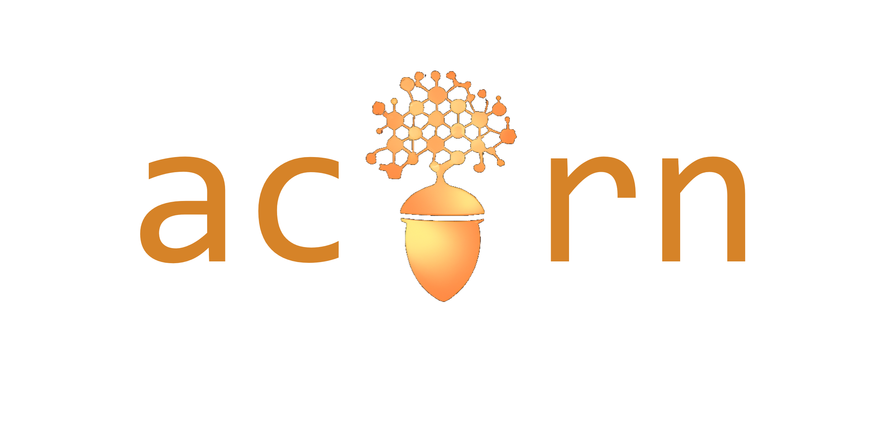

<div align="center">




[](https://atlas-gnn-tracking.docs.cern.ch/)  [](https://gitlab.cern.ch/gnn4itkteam/commonframework/-/commits/dev) [](https://gitlab.cern.ch/gnn4itkteam/commonframework/-/commits/dev)

This repository contains the framework used for developing, testing and presenting the GNN-based ITk track reconstruction project GNN4ITk.

</div>

---

Related work can be found here:
1. https://arxiv.org/abs/2103.06995
2. https://www.epj-conferences.org/articles/epjconf/abs/2021/05/epjconf_chep2021_03047/epjconf_chep2021_03047.html
3. https://cds.cern.ch/record/2815578?ln=en.

**This repository is still under development and may be subject to breaking changes.**

## Get Started

To get started, run the setup commands (Install instructions section below), then take a look at the examples in the `examples` directory. Instructions and further details about the framework are available under the subdirectory of interest - `examples`, `acorn/stages` or `acorn/core`.

## Install

**IMPORTANT! Please use the `dev` branch to run all Examples: it is the latest version and is fully supported!**

To install ACORN, assuming GPU capability, run

```
git checkout dev
conda env create -f gpu_environment.yml
conda activate acorn
pip install -e .
```

---
**IMPORTANT! On December 2, 2023 a major refactoring of the code was merged on `dev`**

If you have previously installed a version of 'acorn' (formerly known as 'gnn4itk_cf' or GNN4ITK CommonFramework) prior to December 2, 2023, it's important to update your setup. Follow the steps below:

```
git checkout dev
git pull dev
conda create --name acorn --clone gnn4itk
conda activate acorn
pip uninstall gnn4itk_cf
pip install -e .
```

You may temporarily retain the existing 'gnn4itk' conda environment for branches still in development with the previous version. If you have any active development branches from the previous setup, swiftly switch them to the 'dev' branch for updates

The new setup introduces the following changes:

- Renames the conda environment from `gnn4itk` to `acorn`
- Updates the command line to use `acorn [train|infer|eval]`
- Old commands `g4i-train`, `g4i-infer`, and `g4i-eval` remain available for backward compatibility.

---


## Framework Structure & Examples

Please see the [documentation](https://atlas-gnn-tracking.docs.cern.ch/) for more details, examples and tutorials.

## Citing this work

If this work is useful for your research, please cite our vCHEP2021 and CTD2022 proceedings:

```
@ARTICLE{YourReferenceHere,
       author = {{Ju}, Xiangyang and {Murnane}, Daniel and {Calafiura}, Paolo and {Choma}, Nicholas and {Conlon}, Sean and {Farrell}, Steve and {Xu}, Yaoyuan and {Spiropulu}, Maria and {Vlimant}, Jean-Roch and {Aurisano}, Adam and {Hewes}, Jeremy and {Cerati}, Giuseppe and {Gray}, Lindsey and {Klijnsma}, Thomas and {Kowalkowski}, Jim and {Atkinson}, Markus and {Neubauer}, Mark and {DeZoort}, Gage and {Thais}, Savannah and {Chauhan}, Aditi and {Schuy}, Alex and {Hsu}, Shih-Chieh and {Ballow}, Alex},
        title = "{Performance of a Geometric Deep Learning Pipeline for HL-LHC Particle Tracking}",
      journal = {arXiv e-prints},
     keywords = {Physics - Data Analysis, Statistics and Probability, Computer Science - Machine Learning, High Energy Physics - Experiment},
         year = 2021,
        month = mar,
          eid = {arXiv:2103.06995},
        pages = {arXiv:2103.06995},
          doi = {10.48550/arXiv.2103.06995},
archivePrefix = {arXiv},
       eprint = {2103.06995},
 primaryClass = {physics.data-an},
       adsurl = {https://ui.adsabs.harvard.edu/abs/2021arXiv210306995J},
      adsnote = {Provided by the SAO/NASA Astrophysics Data System}
}
```

```
@article{YourReferenceHere,
	author = {{Biscarat, Catherine} and {Caillou, Sylvain} and {Rougier, Charline} and {Stark, Jan} and {Zahreddine, Jad}},
	title = {Towards a realistic track reconstruction algorithm based on graph neural networks for the HL-LHC},
	DOI= "10.1051/epjconf/202125103047",
	url= "https://doi.org/10.1051/epjconf/202125103047",
	journal = {EPJ Web Conf.},
	year = 2021,
	volume = 251,
	pages = "03047",
}
```
```
@techreport{YourReferenceHere,
      author        = "Caillou, Sylvain and Calafiura, Paolo and Farrell, Steven
                       Andrew and Ju, Xiangyang and Murnane, Daniel Thomas and
                       Rougier, Charline and Stark, Jan and Vallier, Alexis",
      collaboration = "ATLAS",
      title         = "{ATLAS ITk Track Reconstruction with a GNN-based
                       pipeline}",
      institution   = "CERN",
      reportNumber  = "ATL-ITK-PROC-2022-006",
      address       = "Geneva",
      year          = "2022",
      url           = "https://cds.cern.ch/record/2815578",
}
```

If you use this code in your work, please cite the gnn4itk framework:

```
@misc{YourReferenceHere,
author = {Atkinson, Markus Julian and Caillou, Sylvain and Clafiura, Paolo and Collard, Christophe and Farrell, Steven Andrew and Huth, Benjamin and Ju, Xiangyang and Liu, Ryan and Minh Pham, Tuan and Murnane, Daniel (corresponding author) and Neubauer, Mark and Rougier, Charline and Stark, Jan and Torres, Heberth and Vallier, Alexis},
title = {gnn4itk},
url = {https://github.com/GNN4ITkTeam/CommonFramework}
}
```

## Developing & Contributing

(Optional)

Pre-commit hooks are available for running linting and code formatting. To set them up, run

```
pre-commit install
pre-commit run
```

(If you are using a conda environment, you may need to run `pip install pre-commit` first)